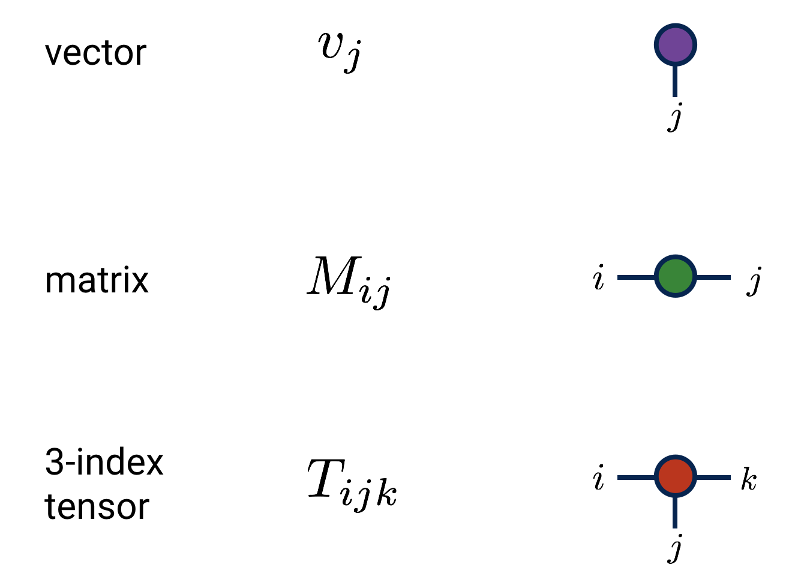
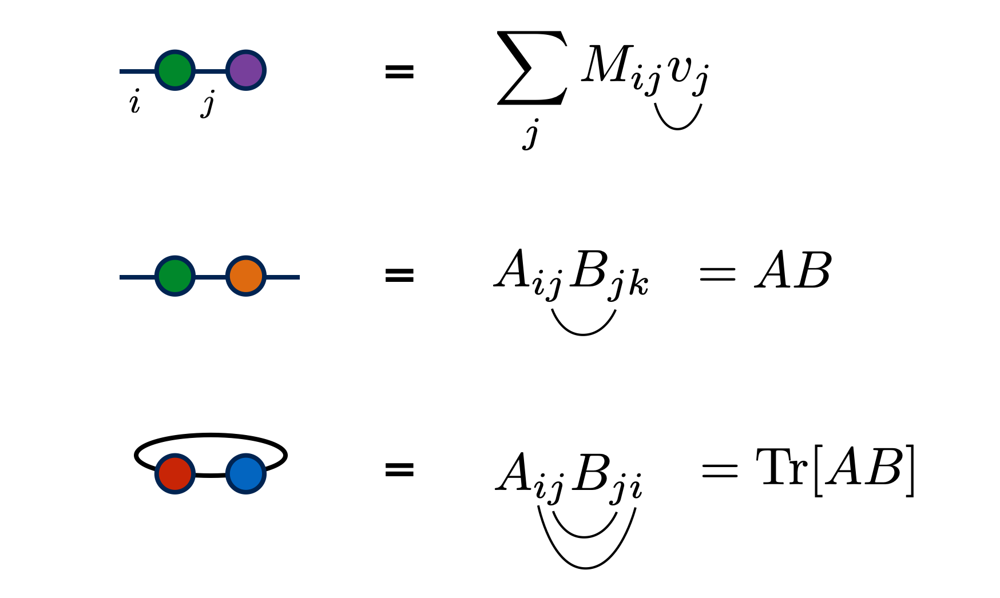
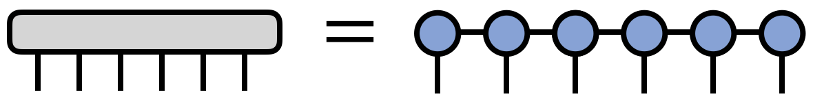
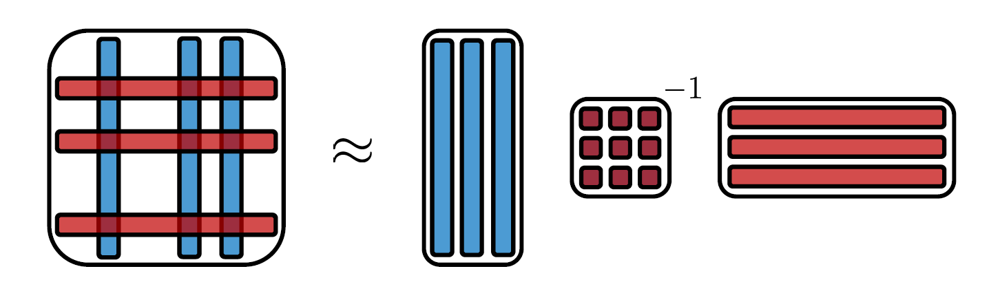

## What this course is

::: q
Simulating a fluid means storing a field on a grid and pushing it forward in time. Both halves scale badly. Can we do the whole computation without ever writing the field down?
:::

- **Parts I–II** build the toolkit — but from inside a PDE solver, not as abstract tensor algebra. Every notion arrives when a numerical method needs it
- **Parts III–IV** spend the toolkit on the forward and inverse problems of CFD, and map the literature you will meet afterwards

. . .

One claim, stated once and tested for six hours: **a physical field is not an arbitrary point in $\mathbb{R}^{2^n}$**. Everything else is bookkeeping around that.

## How to follow along

#### Four parts

- [Part I: Representing a field](#part-i) — what a tensor train is, and why it fits
- [Part II: Linear algebra on the manifold](#part-ii) — solving, and building from samples
- [Part III: The forward problem](#part-iii) — Navier–Stokes, and where ranks stop being small
- [Part IV: The inverse problem](#part-iv) — data in, dynamics out

#### Companion notebooks

Every number in this deck is measured in the repository, on a laptop. Clone it now — Part I has a hands-on segment.

{fig-align="center" height="170"}

## A promise, and its price

::: hero
$2^n \;\longrightarrow\; O(n\chi^2)$
:::

::: {.callout-important appearance="minimal"}
The exponential saving is real, and it is **bought with a truncation error you must monitor at every step**. There is no version of this course where the truncation goes away.
:::

Keep both halves of that sentence together and you will not be misled by anything in the literature.

# Part I {#part-i background-color="#40666e"}

::: mini-agenda
- [Part I: Representing a field](#part-i){.agenda-item .current}
- [Part II: Linear algebra on the manifold](#part-ii){.agenda-item}
- [Part III: The forward problem](#part-iii){.agenda-item}
- [Part IV: The inverse problem](#part-iv){.agenda-item}
:::

::: {.notes}
Part I ends with a working PDE solver. Keep pointing at that: every piece of
vocabulary is introduced because the solver needs it in the next five minutes,
not because it comes next in a textbook.
:::

## Part I — the route

We will write a working PDE solver in ninety minutes. The vocabulary arrives strictly when the solver needs it.

| we need to… | so we learn… |
|---|---|
| draw the computation | Penrose diagrams |
| store the field | matrix product states |
| know *why* it fits | singular values, area laws |
| index a grid | the quantics encoding |
| apply a derivative | matrix product operators |
| take a timestep | MPO application, then **rounding** |

::: lab
`01-walkthrough-representations.ipynb` follows these slides cell by cell
:::

## Diagrams: two moves, and that is all

::: tn

:::

::: q
Why draw pictures instead of writing indices?
:::

- Node = tensor, leg = index, rank = number of legs. A bare node is a scalar
- The diagram carries **exactly** what the index expression carries. Nothing is lost
- What you gain: the *cost* of a computation becomes something you can see [@Bridgeman2017]

<!-- BEGIN generated: slide refs -->
::: slide-refs
[1]&nbsp;Bridgeman & Chubb (2017)
:::
<!-- END generated: slide refs -->

## Contraction is summation, drawn

::: tn

:::

- **Joined legs** — sum over the shared index
- **Dangling legs** — the free indices of the result; count them to know what you built
- **Closed loop** — no free legs, so a number. A trace

Everything in the next six hours is: *place a node, join a leg*.

## Order is cost, and the diagram shows it

::: {.callout-tip}
A chain of $n$ rank-3 tensors, bond dimension $\chi$:

- contract left to right → $O(n\chi^3)$
- form the full vector first → $O(2^n)$

Same diagram, same numbers out, exponentially different bill.
:::

Finding the optimal order for a *general* network is NP-hard [@ChiChung1997; @Pfeifer2014]; for a chain it is obvious. That is one reason chains are what we use.

<!-- BEGIN generated: slide refs -->
::: slide-refs
[2]&nbsp;Chi-Chung *et al.* (1997) · [3]&nbsp;Pfeifer *et al.* (2014)
:::
<!-- END generated: slide refs -->

## One object, two vocabularies

| Quantum many-body | Numerical analysis |
|---|---|
| matrix product state (MPS) | tensor train (TT) |
| bond dimension $\chi$ | TT-rank |
| entanglement across a cut | singular-value decay |
| DMRG sweep | alternating least squares |

The same ansatz was invented twice, seventeen years apart, in communities that were not talking to each other [@White1992; @Oseledets2011]. Both dictionaries are still in use, and both appear in the papers this course draws on.

Reviews: [@Orus2014] from physics, [@Grasedyck2013] from numerics.

<!-- BEGIN generated: slide refs -->
::: slide-refs
[4]&nbsp;White (1992) · [5]&nbsp;Oseledets (2011) · [6]&nbsp;Orús (2014) · [7]&nbsp;Grasedyck *et al.* (2013)
:::
<!-- END generated: slide refs -->

## The wall we are trying to climb

::: q
Why is any of this necessary?
:::

- $2^{nd}$ unknowns on a $2^n$-per-side mesh in $d$ dimensions
- $1024^3 = 2^{30} \approx 10^9$ unknowns — *per field, per timestep*
- 3D direct numerical simulation needs $\sim\mathrm{Re}^{9/4}$ degrees of freedom [@Pope2000; @Orszag1972]

. . .

::: hero
$\mathrm{Re}\sim10^{7} \Rightarrow 10^{16}$ dof
<small>an aircraft at cruise. Exascale moves this wall by two orders of magnitude; the gap is sixteen.</small>
:::

<!-- BEGIN generated: slide refs -->
::: slide-refs
[8]&nbsp;Pope (2000) · [9]&nbsp;Orszag & Patterson (1972)
:::
<!-- END generated: slide refs -->

## No discretisation fixes this

- Finite differences, volumes, elements: all change the constant, never the exponent
- **Every** classical escape exploits structure instead — adaptive meshes, multigrid, spectral methods, POD, wavelets [@Farge1992]
- The tensor-network ansatz is one more of those. Not a different kind of thing

::: q
So: which structure, exactly, are we exploiting?
:::

<!-- BEGIN generated: slide refs -->
::: slide-refs
[10]&nbsp;Farge (1992)
:::
<!-- END generated: slide refs -->

## The bet, made falsifiable

::: tn
<svg viewBox="0 0 640 175" role="img" aria-label="Singular values of a smooth field decay fast; those of noise do not">
  <line class="lg" x1="70" y1="145" x2="600" y2="145"/>
  <line class="lg" x1="70" y1="145" x2="70" y2="20"/>
  <path class="bd" d="M70 30 C 110 95, 150 132, 210 140 L 590 143" fill="none"/>
  <path class="cut" d="M70 40 C 200 52, 400 62, 590 72" fill="none"/>
  <text class="lbl" x="255" y="115">smooth field</text>
  <text class="lbl" x="450" y="50">noise</text>
  <text class="lbl-sm" x="335" y="168">singular value index</text>
  <text class="lbl-sm" x="26" y="85" transform="rotate(-90 26 85)">log σ</text>
</svg>
:::

Cut a field's index in half, reshape to a matrix, take the SVD.

- A smooth multiscale field: machine precision in about ten singular values
- White noise of the same size: no decay at all

**That gap is the compression.** Everything else is machinery.

## Matrix product states

::: tn

:::

$$v_{i_1 i_2 \cdots i_n} = A^{(i_1)}_1 A^{(i_2)}_2 \cdots A^{(i_n)}_n$$

- $\chi$ is the matrix size on the bonds. Parameters $\le 2n\chi^2$, not $2^n$
- Exponential compression **only while $\chi$ stays bounded** — a claim about the data, not about the format

## Why a bounded $\chi$ is even possible

::: tn
<svg viewBox="0 0 620 120" role="img" aria-label="Cutting an MPS chain at one bond; the bond dimension there is the rank across the cut">
  <line class="bd" x1="80" y1="45" x2="540" y2="45"/>
  <circle class="nd" cx="80" cy="45" r="13"/>
  <circle class="nd" cx="185" cy="45" r="13"/>
  <circle class="nd" cx="290" cy="45" r="13"/>
  <circle class="nd" cx="395" cy="45" r="13"/>
  <circle class="nd" cx="500" cy="45" r="13"/>
  <circle class="nd" cx="540" cy="45" r="13"/>
  <line class="cut" x1="240" y1="10" x2="240" y2="85"/>
  <text class="lbl" x="240" y="105">cut k</text>
  <text class="lbl-sm" x="140" y="30">left half</text>
  <text class="lbl-sm" x="400" y="30">right half</text>
</svg>
:::

- The bond at cut $k$ **is** the rank of $v$ reshaped across that cut
- That rank is set by singular-value decay — which physicists read as entanglement
- 1D gapped local Hamiltonians obey an **area law**: a bound independent of $n$ [@Hastings2007; @Eisert2010]

Smooth multiscale functions behave the same way. Noise does not.

<!-- BEGIN generated: slide refs -->
::: slide-refs
[11]&nbsp;Hastings (2007) · [12]&nbsp;Eisert *et al.* (2010)
:::
<!-- END generated: slide refs -->

## Building one: TT-SVD

::: tn
<svg viewBox="0 0 640 130" role="img" aria-label="Sequential SVD splitting one tensor off the chain at each step">
  <rect class="box" x="40" y="30" width="90" height="50" rx="4"/>
  <text class="lbl" x="85" y="60">v</text>
  <text class="lbl" x="85" y="105">reshape</text>
  <text class="lbl" x="165" y="60">⇒</text>
  <circle class="nd" cx="235" cy="55" r="14"/>
  <rect class="box" x="270" y="30" width="80" height="50" rx="4"/>
  <line class="bd" x1="249" y1="55" x2="270" y2="55"/>
  <line class="lg" x1="235" y1="69" x2="235" y2="92"/>
  <text class="lbl" x="310" y="60">rest</text>
  <text class="lbl" x="310" y="105">SVD, truncate</text>
  <text class="lbl" x="385" y="60">⇒</text>
  <circle class="nd" cx="450" cy="55" r="14"/>
  <circle class="nd" cx="510" cy="55" r="14"/>
  <rect class="box" x="545" y="30" width="60" height="50" rx="4"/>
  <line class="bd" x1="450" y1="55" x2="545" y2="55"/>
  <line class="lg" x1="450" y1="69" x2="450" y2="92"/>
  <line class="lg" x1="510" y1="69" x2="510" y2="92"/>
  <text class="lbl" x="530" y="105">repeat</text>
</svg>
:::

Truncating at each cut is **quasi-optimal** — within $\sqrt{n-1}$ of the best rank-$\chi$ approximation [@Oseledets2011].

::: breaks
it needs the dense $2^n$ vector in memory, so only small $n$. Part II builds trains *without* ever forming one, and that is what stops the whole programme being circular.
:::

<!-- BEGIN generated: slide refs -->
::: slide-refs
[5]&nbsp;Oseledets (2011)
:::
<!-- END generated: slide refs -->

## Gauge freedom, and why you want it

::: tn
<svg viewBox="0 0 620 120" role="img" aria-label="Mixed canonical form: left-orthogonal tensors, an orthogonality centre, right-orthogonal tensors">
  <line class="bd" x1="70" y1="50" x2="550" y2="50"/>
  <polygon class="nd" points="58,38 82,50 58,62"/>
  <polygon class="nd" points="158,38 182,50 158,62"/>
  <circle class="nd2" cx="290" cy="50" r="16"/>
  <polygon class="nd" points="422,38 398,50 422,62"/>
  <polygon class="nd" points="552,38 528,50 552,62"/>
  <text class="lbl" x="120" y="95">left-orthogonal</text>
  <text class="lbl" x="290" y="95">centre</text>
  <text class="lbl" x="470" y="95">right-orthogonal</text>
</svg>
:::

- Insert $GG^{-1}$ on any bond and nothing changes. QR sweeps fix the gauge
- In mixed canonical form the environment either side of the centre is the identity
- Payoff: truncation at the centre is **optimal**, and an inner product costs $O(n\chi^3)$ [@Schollwoeck2011]

<!-- BEGIN generated: slide refs -->
::: slide-refs
[13]&nbsp;Schollwöck (2011)
:::
<!-- END generated: slide refs -->

## Rounding is the algorithm

Every operation inflates the rank:

| operation | resulting $\chi$ |
|---|---|
| sum of two trains | $\chi_1 + \chi_2$ |
| elementwise product | $\chi_1 \chi_2$ |
| MPO applied to MPS | $\chi\,\chi_{\text{MPO}}$ |

. . .

So you recompress after **every single one**, at $O(n\chi^3)$. Rounding is not an optimisation bolted on later; it is what makes the arithmetic closed.

## The quantics trick

::: tn
<svg viewBox="0 0 640 150" role="img" aria-label="Grid index written in binary digits, each digit becoming one tensor carrying one length scale">
  <text class="lbl" x="80" y="30">x = 0.i₁i₂i₃…iₙ</text>
  <rect class="box" x="30" y="50" width="120" height="46" rx="4"/>
  <text class="lbl" x="90" y="79">2ⁿ vector</text>
  <text class="lbl" x="180" y="79">⇒</text>
  <line class="bd" x1="240" y1="72" x2="580" y2="72"/>
  <circle class="nd" cx="240" cy="72" r="14"/>
  <circle class="nd" cx="325" cy="72" r="14"/>
  <circle class="nd" cx="410" cy="72" r="14"/>
  <circle class="nd" cx="495" cy="72" r="14"/>
  <circle class="nd" cx="580" cy="72" r="14"/>
  <line class="lg" x1="240" y1="86" x2="240" y2="106"/>
  <line class="lg" x1="325" y1="86" x2="325" y2="106"/>
  <line class="lg" x1="410" y1="86" x2="410" y2="106"/>
  <line class="lg" x1="495" y1="86" x2="495" y2="106"/>
  <line class="lg" x1="580" y1="86" x2="580" y2="106"/>
  <text class="lbl-sm" x="240" y="126">coarsest</text>
  <text class="lbl-sm" x="410" y="126">…</text>
  <text class="lbl-sm" x="580" y="126">finest</text>
  <text class="lbl-sm" x="410" y="42">one tensor per length scale</text>
</svg>
:::

$x = \sum_k i_k 2^{-k}$: digit 1 says which half of the domain, digit 2 which quarter. **One core = one length scale**, and a bond measures the coupling *between* scales [@Khoromskij2011].

<!-- BEGIN generated: slide refs -->
::: slide-refs
[14]&nbsp;Khoromskij (2011)
:::
<!-- END generated: slide refs -->

## The claim that matters

::: q
Does the bond dimension grow when I refine the grid?
:::

$e^{-3x} + \sin(4\pi x)$, tolerance $10^{-10}$:

| $n$ | grid $N$ | max $\chi$ | stored floats | compression |
|---|---|---|---|---|
| 8 | 256 | 3 | 94 | 3× |
| 12 | 4 096 | 3 | 166 | 25× |
| 16 | 65 536 | 3 | 238 | 275× |
| 20 | 1 048 576 | 3 | 310 | **3 383×** |

**Rank tracks smoothness and scale separation, not resolution.** Doubling the resolution adds one core.

## Which functions are cheap

| function | exact QTT rank |
|---|---|
| $e^{ax}$ | 1 |
| $\sin(ax+b)$, $\cos(ax+b)$ | 2 |
| polynomial of degree $p$ | $p+1$ |
| sum of $m$ exponentials | $\le m$ |

The exponential is rank 1 because it **factorises over the digits**:
$e^{a\sum_k i_k 2^{-k}} = \prod_k e^{a i_k 2^{-k}}$. A sine is a sum of two of those [@Oseledets2013].

<!-- BEGIN generated: slide refs -->
::: slide-refs
[15]&nbsp;Oseledets (2013)
:::
<!-- END generated: slide refs -->

## Now predict this one

::: q
A step function — a hard discontinuity. What is its quantics rank?
:::

. . .

::: hero
$\chi = 2$
<small>at any resolution, and wherever the jump sits</small>
:::

Quantics does not see a jump. It sees a **comparison**: $\mathbb{1}[\,i > m\,]$ is decided digit by digit by an automaton with two states — *still equal so far*, and *already decided*.

The folklore "sharp edge ⇒ slow singular-value decay ⇒ huge rank" is **false here**, and believing it sends you looking for the wrong fix.

## So what *is* expensive?

Measured, tolerance $10^{-8}$:

| field | $N=64$ | $N=256$ | $N=1024$ |
|---|---|---|---|
| half-plane $\mathbb{1}[x>0.3]$ | 2 | 2 | 2 |
| **disc** $\mathbb{1}[r<0.25]$ | 17 | 50 | **128** |

A straight edge is free at every resolution. A *curved* boundary cuts across every length scale at once, so every bond must carry information about where it is — and it gets worse as you refine.

::: breaks
this is the geometry problem. Part II buys it off with a smoothed mask, and puts an error bar on the purchase [@Peddinti2024].
:::

<!-- BEGIN generated: slide refs -->
::: slide-refs
[16]&nbsp;Peddinti *et al.* (2024)
:::
<!-- END generated: slide refs -->

## Operators: a derivative is an automaton

::: tn
<svg viewBox="0 0 620 175" role="img" aria-label="A matrix product operator applied to a matrix product state">
  <line class="bd" x1="120" y1="45" x2="500" y2="45"/>
  <rect class="nd" x="106" y="31" width="28" height="28" rx="3"/>
  <rect class="nd" x="201" y="31" width="28" height="28" rx="3"/>
  <rect class="nd" x="296" y="31" width="28" height="28" rx="3"/>
  <rect class="nd" x="391" y="31" width="28" height="28" rx="3"/>
  <rect class="nd" x="486" y="31" width="28" height="28" rx="3"/>
  <line class="lg" x1="120" y1="31" x2="120" y2="10"/>
  <line class="lg" x1="215" y1="31" x2="215" y2="10"/>
  <line class="lg" x1="310" y1="31" x2="310" y2="10"/>
  <line class="lg" x1="405" y1="31" x2="405" y2="10"/>
  <line class="lg" x1="500" y1="31" x2="500" y2="10"/>
  <line class="lg" x1="120" y1="59" x2="120" y2="95"/>
  <line class="lg" x1="215" y1="59" x2="215" y2="95"/>
  <line class="lg" x1="310" y1="59" x2="310" y2="95"/>
  <line class="lg" x1="405" y1="59" x2="405" y2="95"/>
  <line class="lg" x1="500" y1="59" x2="500" y2="95"/>
  <line class="bd" x1="120" y1="110" x2="500" y2="110"/>
  <circle class="nd" cx="120" cy="110" r="14"/>
  <circle class="nd" cx="215" cy="110" r="14"/>
  <circle class="nd" cx="310" cy="110" r="14"/>
  <circle class="nd" cx="405" cy="110" r="14"/>
  <circle class="nd" cx="500" cy="110" r="14"/>
  <text class="lbl" x="60" y="50">MPO</text>
  <text class="lbl" x="60" y="115">MPS</text>
  <text class="lbl-sm" x="310" y="150">result: MPS with bond χ·χₘₚₒ, then round</text>
</svg>
:::

Two physical legs per core, in and out. Cost $O(n\chi^2\chi_{\text{MPO}}^2)$ plus rounding — and the dense $2^n\times 2^n$ matrix is never formed.

## Why the shift operator has rank 2

Shifting by one grid point **is** adding 1 to a binary number. Adding 1 propagates a carry, and a carry is one bit of state:

$$i_k = (j_k + c)\bmod 2, \qquad c' = j_k \wedge c$$

Two states, so $\chi_{\text{MPO}} = 2$. Written down in closed form — nothing fitted, nothing truncated [@Kazeev2013].

. . .

A second derivative is three shifts, hence **rank 3** [@Kazeev2012]. The boundary condition lives entirely in the two edge vectors: change one and you have the periodic shift.

<!-- BEGIN generated: slide refs -->
::: slide-refs
[17]&nbsp;Kazeev *et al.* (2013) · [18]&nbsp;Kazeev & Khoromskij (2012)
:::
<!-- END generated: slide refs -->

## A PDE solver, in one line

$$\partial_t u = \alpha\,\partial_x^2 u \qquad\Longrightarrow\qquad u^{k+1} = \left(\mathbb{1} + \alpha\Delta t\, L\right) u^{k}$$

Two operations per step: **apply an MPO**, then **round**.

- Cost $O(n\chi^3)$, memory $O(n\chi^2)$ — logarithmic in the mesh size
- Measured: 600 steps on a 65 536-point grid in **0.9 s**, on a laptop
- $\chi(t)$ *falls*: diffusion smooths, and smoothness is cheap

::: lab
`01-walkthrough-representations.ipynb`, §7
:::

## What happens if you forget to round

$\chi_k = 3^k\chi_0$, so memory grows like $9^k$:

| step | $\chi$ | memory |
|---|---|---|
| 3 | 54 | 0.3 MiB |
| 5 | 486 | 27 MiB |
| 6 | 1 458 | **243 MiB** |

. . .

One rounding afterwards: $\chi = 4$, **1.2 KiB**. The extra rank was never information — it was bookkeeping.

## Part I — carry these out of the room

1. A physical field lies near a manifold of dimension $O(n\chi^2)$, and singular-value decay is how you check
2. Quantics makes one core = one length scale, so **rank tracks structure, not resolution**
3. Sharpness is not the enemy; *curvature across scales* is
4. Difference operators are exact, low-rank MPOs
5. Every operation is followed by rounding. Forever

::: lab
`01-exercises-representations.ipynb` — five exercises, about 30 minutes
:::

# Part II {#part-ii background-color="#40666e"}

::: mini-agenda
- [Part I: Representing a field](#part-i){.agenda-item}
- [Part II: Linear algebra on the manifold](#part-ii){.agenda-item .current}
- [Part III: The forward problem](#part-iii){.agenda-item}
- [Part IV: The inverse problem](#part-iv){.agenda-item}
:::

::: {.notes}
Part I gave us arithmetic. Part II is about the two things arithmetic alone
cannot give: solving, and constructing from samples. Both are motivated by the
same solver that is already running.
:::

## Part II — the route

Part I did everything with *apply, then round*. That is exactly enough for an explicit scheme, and nothing else.

| the solver needs… | so we learn… |
|---|---|
| an implicit timestep | solving $Ax=b$ on the manifold |
| a rank that adapts | one-site versus two-site sweeps |
| an initial condition | TT-cross and maxvol |
| an obstacle in the flow | smoothed geometry masks |

::: lab
`02-walkthrough-linear-algebra.ipynb`
:::

## Quantics gives resolution; explicit stepping takes it back

::: q
We can now afford $n=20$ in memory. Can we afford it in time?
:::

Stability needs $\alpha\Delta t/\Delta x^2 \le 1/2$ with $\Delta x = 2^{-n}$, so $\Delta t \sim 4^{-n}$ [@Courant1928]:

| $n$ | grid | memory | steps to $t=0.1$ |
|---|---|---|---|
| 10 | 1 024 | ~1 000 floats | $2\times10^{5}$ |
| 20 | 1 048 576 | ~2 000 floats | $2\times10^{11}$ |

Memory grows like $n$; the step count grows like $4^n$. **The compression only pays off together with an implicit scheme.**

<!-- BEGIN generated: slide refs -->
::: slide-refs
[19]&nbsp;Courant *et al.* (1928)
:::
<!-- END generated: slide refs -->

## Solving $Ax = b$ without inverting $A$

$A$ an MPO, $b$ an MPS, $x$ wanted as an MPS.

::: {.callout-warning appearance="minimal"}
Do **not** form $A^{-1}$. It has no reason to be low rank even when $A$ and $x$ both are. (The QTT Laplacian is the instructive exception [@Kazeev2012].)
:::

Minimise over the manifold instead:

$$\min_x \|Ax - b\|^2 \qquad\text{or}\qquad \min_x \tfrac12 x^\top\! A x - x^\top b \;\;(A \succ 0)$$

The manifold is not a vector space — so optimise **one core at a time** [@Oseledets2012].

<!-- BEGIN generated: slide refs -->
::: slide-refs
[18]&nbsp;Kazeev & Khoromskij (2012) · [20]&nbsp;Oseledets & Dolgov (2012)
:::
<!-- END generated: slide refs -->

## Sweeping: one site, then two

::: tn
<svg viewBox="0 0 620 150" role="img" aria-label="One-site and two-site sweeps: a local block is optimized while the rest of the chain is fixed">
  <line class="bd" x1="70" y1="45" x2="550" y2="45"/>
  <circle class="nd" cx="70" cy="45" r="13"/><circle class="nd" cx="166" cy="45" r="13"/>
  <circle class="nd2" cx="262" cy="45" r="15"/>
  <circle class="nd" cx="358" cy="45" r="13"/><circle class="nd" cx="454" cy="45" r="13"/>
  <circle class="nd" cx="550" cy="45" r="13"/>
  <rect class="box" x="240" y="22" width="46" height="46" rx="4"/>
  <text class="lbl" x="262" y="90">one-site</text>
  <line class="bd" x1="70" y1="115" x2="550" y2="115"/>
  <circle class="nd" cx="70" cy="115" r="13"/><circle class="nd" cx="166" cy="115" r="13"/>
  <circle class="nd2" cx="262" cy="115" r="15"/><circle class="nd2" cx="358" cy="115" r="15"/>
  <circle class="nd" cx="454" cy="115" r="13"/><circle class="nd" cx="550" cy="115" r="13"/>
  <rect class="box" x="240" y="92" width="142" height="46" rx="4"/>
  <text class="lbl" x="311" y="12">two-site: SVD-split after the solve, so χ adapts</text>
</svg>
:::

**One-site (ALS)** — freeze all but one core, solve a small dense system exactly, sweep. Monotone [@Holtz2012].
**Two-site** — optimise a pair, split by a *truncated* SVD, so $\chi$ is chosen by a tolerance. Local cost rises to $O(\chi^6)$.

<!-- BEGIN generated: slide refs -->
::: slide-refs
[21]&nbsp;Holtz *et al.* (2012)
:::
<!-- END generated: slide refs -->

## One line of algorithm, a large difference

Backward Euler, $n=14$, residual after 6 sweeps:

| solver | $\chi$ | residual |
|---|---|---|
| ALS, fixed $\chi=4$ | 4 | $2.7\times10^{-3}$ |
| ALS, fixed $\chi=8$ | 8 | $7.6\times10^{-8}$ |
| two-site DMRG | **chose 9** | $3.6\times10^{-8}$ |

The one-site residual plateaus at a level set by the rank you guessed, and **no number of sweeps improves it**. That is the whole reason AMEn exists — one-site sweeps enriched with residual directions, recovering adaptivity at one-site cost [@Dolgov2014].

<!-- BEGIN generated: slide refs -->
::: slide-refs
[22]&nbsp;Dolgov & Savostyanov (2014)
:::
<!-- END generated: slide refs -->

## Krylov, and when to use which

- **CG / GMRES in TT format**: easy to build on existing arithmetic — but each matvec multiplies $\chi$ by $\chi_{\text{MPO}}$ and each addition adds ranks
- Aggressive truncation is then forced, and it destroys the Krylov subspace's orthogonality [@Ballani2013]

::: {.callout-tip appearance="minimal"}
Rule of thumb: **sweeping** for structured PDE operators, where the MPO is known in closed form and warm starts exist. **Krylov** when the operator is effectively a black box.
:::

<!-- BEGIN generated: slide refs -->
::: slide-refs
[23]&nbsp;Ballani & Grasedyck (2013)
:::
<!-- END generated: slide refs -->

## Implicit Euler: what it costs, what it buys

$$\left(\mathbb{1} - \alpha\Delta t\, L\right) u^{k+1} = u^{k}$$

- More work per step: a linear solve instead of a matrix–vector product
- Unconditionally stable, so $\Delta t$ is set by **accuracy**, not by $\Delta x^2$
- $A$ has MPO rank 3 and is written down analytically — no assembly step and no assembly error

::: {.callout-note appearance="minimal"}
Compare schemes by **total wall-clock to a target error**, never by cost per step. Implicit loses on the second measure and wins on the first.
:::

## Warm starting is the largest practical lever

Consecutive solutions differ by $O(\Delta t)$, so the previous answer is an excellent guess.

::: hero
2× faster, measured
<small>one sweep from the previous step versus two from scratch</small>
:::

This is the single biggest reason the observed cost exponent in a production solver is $\chi^{4.1}$ against a worst case of $\chi^{6}$ [@Peddinti2024].

<!-- BEGIN generated: slide refs -->
::: slide-refs
[16]&nbsp;Peddinti *et al.* (2024)
:::
<!-- END generated: slide refs -->

## The error budget has three terms now

1. time discretisation, $O(\Delta t)$
2. space discretisation, $O(\Delta x^2)$
3. **solver residual** — new, and entirely yours to set

| $\Delta t$ | solver $\chi_{\max}$ | residual | error vs exact |
|---|---|---|---|
| $1.3\times10^{-3}$ | 4 | $2.5\times10^{-6}$ | $4.84\times10^{-3}$ |
| $1.3\times10^{-3}$ | 40 | $4.1\times10^{-9}$ | $4.84\times10^{-3}$ |
| $7.8\times10^{-5}$ | 4 | $2.7\times10^{-7}$ | $6.25\times10^{-4}$ |
| $7.8\times10^{-5}$ | 40 | $3.7\times10^{-9}$ | $6.25\times10^{-4}$ |

At coarse $\Delta t$, tightening the solver buys **nothing**. Target one order below the discretisation error, then stop — otherwise you converge efficiently to the wrong answer.

## Where does the initial condition come from?

::: q
We have been assuming the field arrives already compressed. How that assumption is discharged decides whether the method scales.
:::

| route | cost | needs |
|---|---|---|
| analytic cores | free | a closed form [@Oseledets2013] |
| TT-SVD | $O(2^n)$ | the dense vector |
| **TT-cross / TCI** | $O(n\chi^2)$ evaluations | only a black box $f$ |

Without the third row you would need the $2^n$-vector in order to compress the $2^n$-vector.

<!-- BEGIN generated: slide refs -->
::: slide-refs
[15]&nbsp;Oseledets (2013)
:::
<!-- END generated: slide refs -->

## Cross interpolation and maxvol

::: tn

:::

$F \approx C\,\hat F^{-1} R$ — a skeleton (CUR) decomposition applied recursively down the chain [@Oseledets2010].

A rank-$r$ matrix is *exact* from $r$ well-chosen rows and columns. **maxvol** picks the submatrix of largest $|\det|$, greedily; the resulting entries are bounded near 1, which is why the whole thing is stable [@Goreinov2010].

<!-- BEGIN generated: slide refs -->
::: slide-refs
[24]&nbsp;Oseledets & Tyrtyshnikov (2010) · [25]&nbsp;Goreinov *et al.* (2010)
:::
<!-- END generated: slide refs -->

## It works alarmingly well

$e^{-2x} + \sin(6\pi x)$ on a $2^{20}$ grid:

::: hero
6 868 evaluations
<small>0.65% of the grid — relative error $3\times10^{-15}$</small>
:::

Quantics plus cross interpolation is **QTCI**, and the libraries are mature: `xfac` (C++) and `TensorCrossInterpolation.jl` (Julia) [@Ritter2024; @Nunez2025].

<!-- BEGIN generated: slide refs -->
::: slide-refs
[26]&nbsp;Ritter *et al.* (2024) · [27]&nbsp;Núñez Fernández *et al.* (2025)
:::
<!-- END generated: slide refs -->

## Until it does not

| test function | rank 8 | rank 16 |
|---|---|---|
| clean smooth $f$ | $10^{-15}$ | $10^{-15}$ |
| $f$ + 1% noise | $3\times10^{-2}$ | $6\times10^{-2}$ |
| spike, width $10^{-3}$ | $5\times10^{-10}$ | $10^{-15}$ |
| spike, width $10^{-5}$ | **1.00** | **1.00** |

::: breaks
the last row returns *identically zero* and reports a small cross error. No pivot ever lands near the feature, so the method never learns it exists — and nothing in the output says so. A noisy $f$ is interpolated faithfully, noise included.
:::

## Geometry: the problem, restated

- Put an immersed object on a $2^n$ mesh **without touching $2^n$ cells**
- The natural object is an indicator $\theta(q(x))$ — and Part I measured what a curved one costs: $\chi = 17 \to 50 \to 128$ as $N = 64 \to 256 \to 1024$

. . .

So give up the sharp edge **on purpose**, and bound what that costs:

$$m(x) = 1 - e^{-\alpha\left(q(x) + |q(x)|\right)}, \qquad q|_{\partial\Omega} = 0$$

$q+|q|$ vanishes identically where $q<0$, so $m$ is *exactly* zero inside the body. No approximation is made in the interior [@Peddinti2024].

<!-- BEGIN generated: slide refs -->
::: slide-refs
[16]&nbsp;Peddinti *et al.* (2024)
:::
<!-- END generated: slide refs -->

## Pricing the trade honestly

| | $\chi$ at $10^{-1}$ | $\chi$ at $10^{-2}$ | $\chi$ at $10^{-6}$ | $L_2$ to indicator |
|---|---|---|---|---|
| sharp | 33 | 75 | 80 | 0 |
| $\alpha=50$ | **13** | **34** | 92 | 0.28 |
| $\alpha=1000$ | 27 | 74 | 94 | 0.059 |
| $\alpha=5000$ | 31 | 78 | 88 | 0.023 |

- Distance to the true indicator falls as $\alpha^{-1/2}$ — measured exponent $-0.53$, against the bound $\sqrt{\ell_0^{D-2}/\alpha}$
- **Smoothing does not reduce rank at tight tolerance.** It buys rank *at the accuracy you actually want*

The defensible statement is not "smooth it because sharp is expensive", but: **$\alpha$ prices geometric fidelity against rank, and the price is known.**

## Putting geometry to work

- Build $m$ by TT-cross to tolerance $\varepsilon$ — at a cost independent of mesh size
- Apply it by an **elementwise (Hadamard) product** each step: no-slip without meshing the body, and no immersed-boundary force term
- Inlet and outlet fold into the differential MPOs via ghost cells
- NACA 0040 airfoil: $\chi = 45$, 18 800 parameters, $27.9\times$ compression [@Peddinti2024]

::: lab
`02-exercises-linear-algebra.ipynb`, Ex. 4 — set $\alpha$ from a requirement, not by taste
:::

<!-- BEGIN generated: slide refs -->
::: slide-refs
[16]&nbsp;Peddinti *et al.* (2024)
:::
<!-- END generated: slide refs -->

## Part II — what is not settled

- **Preconditioning in TT format** — largely unsolved, and the biggest single lever on cost. Structurally hard: a preconditioner approximates $A^{-1}$, and low-rank $A$ rarely has a low-rank inverse
- **Error control** — no sharp a-posteriori bound from truncation tolerance $\varepsilon$ to accumulated PDE error. In practice one assumes $O(K\varepsilon)$ after $K$ steps and checks empirically
- **Nonlinearity** — products square $\chi$, and the interaction between iteration error and truncation error is not understood
- **TT-cross robustness** — pivot selection is heuristic, with no guarantee for a noisy or adversarial $f$

::: lab
`02-exercises-linear-algebra.ipynb` — four exercises, about 30 minutes
:::

# Part III {#part-iii background-color="#40666e"}

::: mini-agenda
- [Part I: Representing a field](#part-i){.agenda-item}
- [Part II: Linear algebra on the manifold](#part-ii){.agenda-item}
- [Part III: The forward problem](#part-iii){.agenda-item .current}
- [Part IV: The inverse problem](#part-iv){.agenda-item}
:::

::: {.notes}
Parts I and II built a toolkit on a problem chosen for its docility. Part III
points it at something that fights back. The structure of the part is: what the
equations demand, how a solver is built, why fluids are the right target, and
then the question everything hinges on — when does chi actually stay small.
:::

## Part III — the route

::: q
The toolkit works on the heat equation. What happens when the PDE stops cooperating?
:::

| Navier–Stokes brings… | which is awkward because… |
|---|---|
| nonlinear advection | products of trains, so ranks **multiply** |
| a nonlocal pressure constraint | a global elliptic solve every step |
| geometry | curved boundaries, hence rank (Part II) |

Then the two questions that decide whether any of this matters: **why fluids**, and **when is $\chi$ small**.

## Incompressible Navier–Stokes

$$\partial_t \mathbf{v} + (\mathbf{v}\cdot\nabla)\mathbf{v}
  = -\frac{1}{\rho}\nabla p + \nu\nabla^2\mathbf{v},
  \qquad \nabla\cdot\mathbf{v} = 0$$

Three difficulties, each awkward for a tensor network in a *different* way — which is convenient, because it means each one teaches something separate.

Existence and smoothness of solutions is, famously, still open [@Fefferman2000]. We are not going to settle that today.

<!-- BEGIN generated: slide refs -->
::: slide-refs
[28]&nbsp;Fefferman (2000)
:::
<!-- END generated: slide refs -->

## Why pressure is the hard part

- Pressure is **not dynamical**. There is no evolution equation for it
- It is whatever enforces $\nabla\cdot\mathbf{v}=0$ *instantly*: a constraint, not a dynamics
- Taking the divergence of the momentum equation gives an elliptic problem

$$\nabla^2 p = -\rho\,\nabla\cdot\!\left[(\mathbf{v}\cdot\nabla)\mathbf{v}\right]$$

This couples the whole domain at once, and it is where the runtime goes — classical solver or tensor one [@Chorin1968; @Temam1969].

<!-- BEGIN generated: slide refs -->
::: slide-refs
[29]&nbsp;Chorin (1968) · [30]&nbsp;Temam (1969)
:::
<!-- END generated: slide refs -->

## Chorin projection, in tensor form

::: tn
<svg viewBox="0 0 640 120" role="img" aria-label="Three stages of the projection method: predictor, pressure Poisson solve, projection">
  <rect class="box" x="20" y="30" width="150" height="52" rx="5"/>
  <text class="lbl" x="95" y="52">predictor</text>
  <text class="lbl-sm" x="95" y="70">MPO + Hadamard</text>
  <line class="bd" x1="176" y1="56" x2="216" y2="56"/>
  <rect class="box" x="222" y="30" width="180" height="52" rx="5"/>
  <text class="lbl" x="312" y="52">pressure Poisson</text>
  <text class="lbl-sm" x="312" y="70">DMRG solve · 80% of runtime</text>
  <line class="bd" x1="408" y1="56" x2="448" y2="56"/>
  <rect class="box" x="454" y="30" width="160" height="52" rx="5"/>
  <text class="lbl" x="534" y="52">projection</text>
  <text class="lbl-sm" x="534" y="70">restore ∇·v = 0</text>
  <text class="lbl-sm" x="320" y="106">round after every stage</text>
</svg>
:::

$$\mathbf{v}^{*} = \mathbf{v}^{t} + \Delta t\left(-(\mathbf{v}^t\!\cdot\!\nabla)\mathbf{v}^t + \nu\nabla^2\mathbf{v}^t\right)$$
$$\nabla^2 p = \tfrac{\rho}{\Delta t}\nabla\!\cdot\!\mathbf{v}^{*}, \qquad \mathbf{v}^{t+1} = \mathbf{v}^{*} - \tfrac{\Delta t}{\rho}\nabla p$$

## The encoding

- One MPS per velocity and pressure component, over $n = n_x + n_y\,(+\,n_z)$ quantics bits
- Bits **interleaved** across coordinates, so each scale stays local along the chain
- Gradient, divergence, Laplacian: MPOs of rank 2–5, built once, analytically [@Kazeev2012]
- Everything downstream is MPO application, Hadamard product, rounding

::: lab
`03-walkthrough-forward-problem.ipynb` builds exactly this on a $64^2$ grid
:::

<!-- BEGIN generated: slide refs -->
::: slide-refs
[18]&nbsp;Kazeev & Khoromskij (2012)
:::
<!-- END generated: slide refs -->

## A detail that costs a day if you get it wrong

::: q
Which Laplacian goes in the pressure solve?
:::

The pressure operator must be $\mathrm{div}(\mathrm{grad})$ built from **the same** difference operators used for the gradient and the divergence.

. . .

Substitute the compact three-point Laplacian and the projection stops projecting — the divergence falls by a factor of a few instead of a factor of a thousand, and it looks exactly like "the solver is a bit inaccurate".

Measured on one step: $\|\nabla\cdot\mathbf{v}\|$ goes from $7.7$ to $4\times10^{-3}$ when the operators match.

## Where the time actually goes

40 steps on a $64\times64$ grid, measured:

| stage | share |
|---|---|
| predictor (advection + diffusion) | 17% |
| **pressure Poisson solve** | **82%** |
| projection | 1% |

The production 3D solver reports 80.1% [@Peddinti2024]. Same story at a thousandth of the size.

::: {.callout-tip appearance="minimal"}
To first order, any effort spent anywhere other than the elliptic solve is wasted. That is why preconditioning in TT format is the open problem with the largest payoff.
:::

<!-- BEGIN generated: slide refs -->
::: slide-refs
[16]&nbsp;Peddinti *et al.* (2024)
:::
<!-- END generated: slide refs -->

## Truncation does not respect physics

20 steps, varying only the rank cap:

| $\chi_{\max}$ | $\|\nabla\cdot\mathbf{v}\|$ after 20 steps |
|---|---|
| 8 | $1.2\times10^{1}$ |
| 16 | $1.6\times10^{0}$ |
| 32 | $4.1\times10^{-2}$ |
| 48 | $5.9\times10^{-4}$ |

SVD truncation is optimal in the Frobenius norm, and the Frobenius norm knows nothing about $\nabla\cdot\mathbf{v}=0$. Every rounding puts a little divergence back; the projection takes it out again; $\chi_{\max}$ sets the balance.

::: breaks
**structure-preserving rounding** — truncation that conserves mass, energy, or the constraint — is genuinely open. For now, $\chi_{\max}$ is the knob and the divergence is the diagnostic.
:::

## Reading out without decompressing

::: q
If you have to rebuild the $2^{2n}$ array to look at the answer, what did the compression buy?
:::

| grid | one point | $16\times16$ coarse field | full field |
|---|---|---|---|
| $32^2$ | 17 µs | 1.5 ms | 0.08 ms |
| $1024^2$ | 29 µs | 1.6 ms | **12.1 ms** |

Cells grew by 1 000×. The first two columns barely moved.

Coarse-graining is just contracting the finest bits against $(1,1)/2$ — average pooling, at $O(n\chi^3)$. **Build your diagnostics to work on the train.**

## Cost against resolution

| $n$ | cells | s / step |
|---|---|---|
| 5 | 1 024 | 0.37 |
| 6 | 4 096 | 1.48 |
| 7 | 16 384 | 3.76 |
| 8 | 65 536 | 6.95 |

64× the cells for ~20× the work — sublinear in cell count, which is the point, but **above** the $O(n)$ the scaling argument promises.

Why: unoptimised Python, and per-site constants dominated by the local solves. The tuned solver measures $n\chi^{4.1}$ against a worst case of $n\chi^{6}$ [@Peddinti2024]. Take the *shape* of the curve from this table, not the constant.

<!-- BEGIN generated: slide refs -->
::: slide-refs
[16]&nbsp;Peddinti *et al.* (2024)
:::
<!-- END generated: slide refs -->

## Benchmarks worth knowing

| case | what it tests | reference |
|---|---|---|
| lid-driven cavity | closed domain, no geometry | [@Ghia1982] |
| flow past a cylinder | steady pair, then a Kármán street | [@Schaefer1996; @Williamson1996] |
| NACA 0040 airfoil | non-trivial immersed geometry | [@Abbott1945] |
| decaying isotropic turbulence | rank behaviour at high $\mathrm{Re}$ | [@Pope2000] |

Published QTT results: $2^{30}$ cells at $\chi=30$, 24 200 parameters, compression $\sim\!4.4\times10^{4}$, $\mathrm{Re}$ from 1.7 to 2 230, validated against Ansys Fluent [@Peddinti2024].

<!-- BEGIN generated: slide refs -->
::: slide-refs
[8]&nbsp;Pope (2000) · [16]&nbsp;Peddinti *et al.* (2024) · [31]&nbsp;Ghia *et al.* (1982) · [32]&nbsp;Schäfer & Turek (1996) · [33]&nbsp;Williamson (1996) · [34]&nbsp;Abbott *et al.* (1945)
:::
<!-- END generated: slide refs -->

## Navigating the field

Everyone is solving the same three problems; they differ in where they put the ansatz.

| approach | discretisation | who |
|---|---|---|
| projection / fractional step | finite difference | [@Peddinti2024; @Huelst2025; @Hoelscher2025] |
| reduced-order models | modal | [@Kiffner2023] |
| finite elements in TT | FEM | [@Kornev2024; @Kornev2023] |
| space-time collocation | spectral | [@Adak2024; @Adak2025] |
| kinetic / phase space | Vlasov, Boltzmann | [@Ye2022; @Truong2023] |
| statistics rather than fields | PDF transport | [@Gourianov2025] |

The ansatz is portable. **The global solve is always the hard part.**

<!-- BEGIN generated: slide refs -->
::: slide-refs
[16]&nbsp;Peddinti *et al.* (2024) · [35]&nbsp;van Hülst *et al.* (2025) · [36]&nbsp;Hölscher *et al.* (2025) · [37]&nbsp;Kiffner & Jaksch (2023) · [38]&nbsp;Kornev *et al.* (2024) · [39]&nbsp;Kornev *et al.* (2023) · [40]&nbsp;Adak *et al.* (2024) · [41]&nbsp;Adak *et al.* (2025) · [42]&nbsp;Ye & Loureiro (2022) · [43]&nbsp;Truong *et al.* (2023) · [44]&nbsp;Gourianov *et al.* (2025)
:::
<!-- END generated: slide refs -->

## Why fluids, and not something easier

- CFD is a top consumer of HPC: aerodynamics, weather, climate, combustion, biomedical flow
- The bottleneck is resolution, and resolution costs $\sim\mathrm{Re}^{9/4}$ in 3D
- RANS and LES are *models*: tuned closures with limited transfer between regimes

. . .

And the structural reason: turbulence is a **cascade**, with well-separated scales coupling weakly [@Gourianov2022; @Eyink2005]. Quantics gives a scale-by-scale representation for free.

**The physics hierarchy and the ansatz hierarchy are the same hierarchy.**

<!-- BEGIN generated: slide refs -->
::: slide-refs
[45]&nbsp;Gourianov *et al.* (2022) · [46]&nbsp;Eyink (2005)
:::
<!-- END generated: slide refs -->

## Expressivity: the question everything hinges on

::: q
Everything so far assumed $\chi$ stays small. When is that true?
:::

Two sub-questions with different answers:

- $\chi$ versus **resolution** at fixed physics — benign. That is the quantics promise, measured in Part I
- $\chi$ versus **Reynolds number** — the real question

. . .

Measured on synthetic fields with a widening inertial range:

| inertial range $k_{\max}$ | 4 | 8 | 16 | 32 | 64 |
|---|---|---|---|---|---|
| $\chi$ at $10^{-2}$ | 14 | 26 | 41 | 68 | **128** |

The rank climbs with the *width of the inertial range*, not with the grid.

## 3D turbulence at $\mathrm{Re}_\lambda = 315$

DNS on $1024^3 = 2^{30}$ points, encoded as 30-core trains [@Pisoni2026]:

| $\chi$ | parameters kept | what survives |
|---|---|---|
| 1000 | 2.2% | the full flat inertial range of $E(k)$ |
| 100 | 0.03% | a stable solver for 9–10 turnover times |

Four orders of magnitude of compression with the spectrum essentially intact.

<!-- BEGIN generated: slide refs -->
::: slide-refs
[47]&nbsp;Pisoni *et al.* (2026)
:::
<!-- END generated: slide refs -->

## What breaks first, and why you would miss it

::: q
Which diagnostic tells you the compression went too far?
:::

Measured here, compressing an intermittent 2D field:

| $\chi$ | $L_2$ error | spectrum error | flatness (true: 37.6) |
|---|---|---|---|
| 16 | 0.61 | 37% | 119 |
| 32 | 0.42 | 13% | 64 |
| 64 | 0.21 | **1.4%** | 44 |

**The spectrum recovers first and is therefore the diagnostic least able to warn you.** Judge a compressed turbulent field on the PDFs of its velocity increments, not on $E(k)$ [@Pisoni2026].

<!-- BEGIN generated: slide refs -->
::: slide-refs
[47]&nbsp;Pisoni *et al.* (2026)
:::
<!-- END generated: slide refs -->

## Bit ordering, honestly

::: q
Interleaved or stacked? The answer depends on what you measure.
:::

| field | matched tolerance | matched $\chi$ |
|---|---|---|
| separable $f(x)g(y)$ | **stacked** wins, decisively | tie |
| disc indicator | interleaved | **interleaved** |
| $k^{-5/3}$ turbulence | stacked | **interleaved** |

A product $f(x)g(y)$ is rank 1 across the stacked cut *by definition* — which is how the folklore "stacked is fine" survives on textbook test functions.

For real fields: stacking is more efficient asymptotically, interleaving **degrades more gracefully**. In a large simulation you never choose the tolerance; you choose $\chi$.

## The honest claim

- **Supported**: turbulence compresses well at moderate Reynolds number, and the evidence is quantitative
- **Not supported**: low rank at arbitrary Reynolds number and every scale
- The $\chi = 100$ ceiling in the 3D solver is a memory-bound implementation, not physics
- Flip side, and genuinely striking: random low-rank trains ($\chi=10$) cascaded across scales **synthesise** divergence-free turbulent-like fields with the correct spectrum and flatness, at logarithmic cost [@Pisoni2026]

<!-- BEGIN generated: slide refs -->
::: slide-refs
[47]&nbsp;Pisoni *et al.* (2026)
:::
<!-- END generated: slide refs -->

## Part III — outlook

- **Higher $\mathrm{Re}$, full 3D** — lifting $\chi=100$ is engineering before it is physics
- **Better solvers** — TT preconditioning, distributed sweeps, mixed precision, GPUs [@Hoelscher2025]. Poisson is 80% of the runtime
- **Adaptivity** — choose $\chi(t)$ and $\Delta t$ from a live error estimate [@Lubich2015]
- **Structure-preserving truncation** — keep $\nabla\cdot\mathbf{v}=0$ and the conserved quantities under rounding
- **Compressible and multiphysics** — shocks, reacting flow, MHD; rank behaviour largely unmapped [@Peddinti2025]
- **Theory gap** — no sharp rank bounds for Navier–Stokes solutions against $\mathrm{Re}$

::: lab
`03-exercises-forward-problem.ipynb` — four exercises, about 30 minutes
:::

<!-- BEGIN generated: slide refs -->
::: slide-refs
[36]&nbsp;Hölscher *et al.* (2025) · [48]&nbsp;Lubich *et al.* (2015) · [49]&nbsp;Peddinti *et al.* (2025)
:::
<!-- END generated: slide refs -->

# Part IV {#part-iv background-color="#40666e"}

::: mini-agenda
- [Part I: Representing a field](#part-i){.agenda-item}
- [Part II: Linear algebra on the manifold](#part-ii){.agenda-item}
- [Part III: The forward problem](#part-iii){.agenda-item}
- [Part IV: The inverse problem](#part-iv){.agenda-item .current}
:::

::: {.notes}
Part IV inverts Part III. The single idea is that a space-time tensor train
already contains the SVD that standard DMD spends its whole budget computing.
Everything else follows from that.
:::

## Part IV — the route

::: q
Parts I–III: the equation is known, the solution is wanted. Now invert that.
:::

- Available: snapshots $\{u(t_k)\}$ from an experiment, a DNS, or a row of sensors
- Missing: the operator, the closure, sometimes the equation itself
- This is the regime of most measurement data, and of systems too complex to write down

| we want to… | so we learn… |
|---|---|
| forecast, or identify? | the two tasks, kept apart |
| compress time as well as space | the space-time train |
| avoid the snapshot SVD | MPS-DMD |

## Two tasks, kept apart

| task | goal | interpretable model |
|---|---|---|
| **prediction** | forecast $u(t_{K+k})$ | not required |
| **identification** | recover the operator or the equations | the entire point |

Methods strong at one are often weak at the other, and the literature frequently reports the easy one.

Classical toolkit: POD/PCA [@Sirovich1987; @Berkooz1993], DMD and Koopman [@Schmid2010; @Rowley2009; @Mezic2005], SINDy [@Brunton2016], operator learning [@Raissi2019; @Lu2021; @Li2021].

<!-- BEGIN generated: slide refs -->
::: slide-refs
[50]&nbsp;Sirovich (1987) · [51]&nbsp;Berkooz *et al.* (1993) · [52]&nbsp;Schmid (2010) · [53]&nbsp;Rowley *et al.* (2009) · [54]&nbsp;Mezi\'c (2005) · [55]&nbsp;Brunton *et al.* (2016) · [56]&nbsp;Raissi *et al.* (2019) · [57]&nbsp;Lu *et al.* (2021) · [58]&nbsp;Li *et al.* (2021)
:::
<!-- END generated: slide refs -->

## The same curse, again

- The snapshot matrix is $N_x \times N_t$ with $N_x = 2^n$. Even the SVD is prohibitive
- Data adds its own problems: sparse, noisy, short, non-stationary, and with no guaranteed closed model

. . .

Tensor-network promise: compress space **and** time, do the algebra inside the format, keep the modes interpretable — and a model in MPS form feeds straight back into the Part III solver.

## Dynamic mode decomposition

$$u_{k+1} \approx A\,u_k$$

$$X = U\Sigma V^\dagger, \quad \tilde{A} = U^\dagger X' V \Sigma^{-1}, \quad \tilde{A} = W\Lambda W^{-1}, \quad \Phi = UW$$

- Each eigenvalue gives a growth rate and a frequency; each eigenvector a spatial mode
- Koopman view: a finite-rank approximation of a linear infinite-dimensional operator acting on observables — which is why a linear method can describe nonlinear dynamics [@Rowley2009; @Tu2014]

The bottleneck is the first factorisation. The zoo of variants is mapped in [@Schmid2022; @Colbrook2024].

<!-- BEGIN generated: slide refs -->
::: slide-refs
[53]&nbsp;Rowley *et al.* (2009) · [59]&nbsp;Tu *et al.* (2014) · [60]&nbsp;Schmid (2022) · [61]&nbsp;Colbrook (2024)
:::
<!-- END generated: slide refs -->

## Space and time in a single train

::: tn
<svg viewBox="0 0 640 155" role="img" aria-label="Space bits and time bits placed in one matrix product state chain">
  <line class="bd" x1="90" y1="55" x2="560" y2="55"/>
  <circle class="nd" cx="90" cy="55" r="14"/><circle class="nd" cx="184" cy="55" r="14"/>
  <circle class="nd" cx="278" cy="55" r="14"/>
  <circle class="nd2" cx="372" cy="55" r="14"/><circle class="nd2" cx="466" cy="55" r="14"/>
  <circle class="nd2" cx="560" cy="55" r="14"/>
  <line class="lg" x1="90" y1="69" x2="90" y2="92"/>
  <line class="lg" x1="184" y1="69" x2="184" y2="92"/>
  <line class="lg" x1="278" y1="69" x2="278" y2="92"/>
  <line class="lg" x1="372" y1="69" x2="372" y2="92"/>
  <line class="lg" x1="466" y1="69" x2="466" y2="92"/>
  <line class="lg" x1="560" y1="69" x2="560" y2="92"/>
  <text class="lbl-sm" x="184" y="112">space bits · log₂ Nₓ</text>
  <text class="lbl-sm" x="466" y="112">time bits · log₂ N&#8348;</text>
  <line class="cut" x1="325" y1="20" x2="325" y2="90"/>
  <text class="lbl" x="325" y="140">space/time bond</text>
</svg>
:::

Binarise **both** $x$ and $t$ onto one chain [@Peddinti2025a; @Shinaoka2023]. Time stops being a loop and becomes more legs.

<!-- BEGIN generated: slide refs -->
::: slide-refs
[62]&nbsp;Peddinti *et al.* (2025) · [63]&nbsp;Shinaoka *et al.* (2023)
:::
<!-- END generated: slide refs -->

## The bond *is* the temporal complexity

::: q
How many degrees of freedom does this dataset have in time?
:::

Read it off. No algorithm required:

| dataset | space/time bond |
|---|---|
| standing wave $\sin(2\pi x)\cos(2\pi t)$ | **1** |
| travelling wave $\sin(2\pi(x-ct))$ | **2** |
| three travelling modes | **5** |
| white noise | **512** |

A standing wave is a single product $f(x)g(t)$. A travelling wave is a sum of two. Noise has nothing to share.

## MPS-DMD: the SVD is already there

::: tn
<svg viewBox="0 0 620 130" role="img" aria-label="Mixed canonical gauge at the space-time bond yields the SVD factors directly">
  <line class="bd" x1="60" y1="48" x2="540" y2="48"/>
  <polygon class="nd" points="48,36 72,48 48,60"/>
  <polygon class="nd" points="148,36 172,48 148,60"/>
  <circle class="nd2" cx="290" cy="48" r="16"/>
  <polygon class="nd" points="422,36 398,48 422,60"/>
  <polygon class="nd" points="542,36 518,48 542,60"/>
  <text class="lbl" x="110" y="90">U</text>
  <text class="lbl" x="290" y="90">Σ</text>
  <text class="lbl" x="470" y="90">V†</text>
  <text class="lbl-sm" x="290" y="118">Schmidt decomposition at the space/time bond</text>
</svg>
:::

1. **Gauge** to mixed canonical form at the space/time bond. The Schmidt decomposition *is* $U\Sigma V^\dagger$
2. **Shift and project**: a rank-2 time-shift MPO gives $\tilde{A} = \Sigma (V^\dagger T V)\Sigma^{-1}$, a $\chi\times\chi$ matrix
3. **Eigendecompose**. Modes $\Phi = UW$, still in train form

Earlier tensor DMD variants stayed linear in $N_t$ [@Klus2018].

<!-- BEGIN generated: slide refs -->
::: slide-refs
[64]&nbsp;Klus *et al.* (2018)
:::
<!-- END generated: slide refs -->

## The result

::: hero
agreement to $2\times10^{-15}$
<small>MPS-DMD versus exact DMD, on the same data</small>
:::

| $N_t$ | exact DMD | MPS-DMD (given the train) |
|---|---|---|
| 64 | 6 ms | 1.5 ms |
| 4 096 | 1 045 ms | **2.3 ms** |

Same modes, same eigenvalues, same predictions — logarithmic in $N_t$ instead of polynomial.

## One subtlety, stated out loud

The non-periodic time shift sends the final snapshot to zero, so the raw projection is $QP^\top$ rather than the least-squares $QP^{+}$ that DMD actually wants.

Writing $v$ for the last column of $V^\dagger$:
$$P P^\top = I - vv^\top$$

so one Sherman–Morrison rank-one correction recovers exact DMD.

. . .

Skip it and every eigenvalue is damped by $\approx 1/N_t$ per step — **invisible in the spectrum, ruinous after a few hundred steps of prediction**. Measured: $2.9\times10^{-3}$ damping against $1/N_t = 1.9\times10^{-3}$.

## Prediction, and what it means

$u(T+k) = U W \Lambda^k W^{-1} U^\dagger u_T$: one diagonal multiply, one contraction. The cost does not depend on how far ahead you look.

| steps ahead | relative error |
|---|---|
| within the data | $10^{-13}$ |
| 500 beyond | $10^{-12}$ |
| 2 500 beyond | $4\times10^{-12}$ |

It extrapolates because it identified the **operator**, not because it memorised the data — and that is also the honest limit. If the dynamics are not close to linear in the observables you supplied, no amount of data rescues it.

## Where DMD fails, and how quietly

| dataset | what comes back |
|---|---|
| exponential growth | exact |
| **standing wave** | one eigenvalue, in-sample error 1.6 |
| swept frequency | a fit with no predictive content |
| $\tanh$ nonlinearity | fits in-sample, meaningless outside |

A standing wave has spatial rank 1, so DMD can only ever return *one* eigenvalue — the two frequencies generating $\cos(2\pi t)$ are not visible in a one-dimensional column space. The fix is a time-delay (Hankel) embedding.

::: breaks
none of these fail loudly. The algorithm returns eigenvalues and modes in every case. **You have to check.**
:::

## Removing the time loop entirely

Assemble the *whole* space-time system as one MPO and solve it once:

$$\frac{U_k - U_{k-1}}{\Delta\tau} - \alpha L_x U_k = f_k \qquad\Longrightarrow\qquad M\,U = b$$

- Measured here: $M$ has rank 3, $M^\top M$ rank 5; **one solve for all 64 timesteps**, in 0.08 s, at $\chi=2$
- Published: heat and wave at $\chi = 2$–22, Burgers and nonlinear diffusion at $\chi=10$, both $>99\%$ compression on a $1024\times1024$ space-time grid [@Peddinti2025a]
- Nonlinear terms by Picard iteration — linear convergence; Newton would give quadratic

Classical space-time methods make the same move without the compression [@Steinbach2019; @Wick2023].

<!-- BEGIN generated: slide refs -->
::: slide-refs
[62]&nbsp;Peddinti *et al.* (2025) · [65]&nbsp;Steinbach & Yang (2019) · [66]&nbsp;Wick (2023)
:::
<!-- END generated: slide refs -->

## What the all-at-once solve actually costs

::: q
If removing the time loop is so good, why does anyone still step?
:::

The space/time bond, measured on the same solve:

| initial condition | space/time bond |
|---|---|
| a discrete eigenvector (separable) | 1 |
| a narrow Gaussian bump | 16 |

Diffusing a localised bump is not a short sum of products of a function of $x$ and a function of $t$. **That bond is the price**, and bounding it is what the space-time papers spend their effort on [@Dolgov2012; @Breiten2021].

<!-- BEGIN generated: slide refs -->
::: slide-refs
[67]&nbsp;Dolgov *et al.* (2012) · [68]&nbsp;Breiten *et al.* (2021)
:::
<!-- END generated: slide refs -->

## Noise: a technique, or an accident?

Truncating the space-time train to the true rank improves the recovered eigenvalues by an order of magnitude — the noise lives in the discarded singular values.

. . .

But: the crossover is empirical, the "true rank" is exactly what you did not know, and nothing in the output distinguishes truncating the noise from truncating the physics.

::: breaks
this is an open problem, not a technique. So is uncertainty quantification on tensor-network predictions, and so is the extension of this analysis beyond one spatial dimension.
:::

## Part IV — outlook

- **Beyond (1+1)D** — the analysis here is 1D in space; 2D/3D plus time, and its index ordering, is open
- **Koopman extensions** — extended DMD with TT dictionaries [@Williams2015], kernel DMD compressed
- **Equation discovery** — SINDy over tensor-product dictionaries in TT form [@Gelss2019; @Brunton2016]
- **Streaming** — update the train as data arrives, without recompressing from scratch [@Kressner2023]
- **Hybrid physics + data** — the Part III solver as a prior, learn only the closure or the residual [@Sroda2025]
- **Software and benchmarks** — shared tooling [@Nunez2025], standard datasets, honest baselines

<!-- BEGIN generated: slide refs -->
::: slide-refs
[27]&nbsp;Núñez Fernández *et al.* (2025) · [55]&nbsp;Brunton *et al.* (2016) · [69]&nbsp;Williams *et al.* (2015) · [70]&nbsp;Gel\ss *et al.* (2019) · [71]&nbsp;Kressner *et al.* (2023) · [72]&nbsp;\'Sroda *et al.* (2025)
:::
<!-- END generated: slide refs -->

## Why this, rather than a neural surrogate

- **Interpretability is the edge.** Modes, frequencies and growth rates come out directly — you can argue with them
- The same encoding feeds back into the forward solver, and forward into quantum algorithms built on the same ansatz [@Lubasch2020; @Jaksch2023]
- Compression is controlled by one number you set, not by a training run

. . .

And the standing obligation: **report the diagnostic that fails first, not the one that survives.**

::: lab
`04-exercises-inverse-problem.ipynb` — four exercises, about 30 minutes
:::

<!-- BEGIN generated: slide refs -->
::: slide-refs
[73]&nbsp;Lubasch *et al.* (2020) · [74]&nbsp;Jaksch *et al.* (2023)
:::
<!-- END generated: slide refs -->

## The six hours, in five lines

1. A physical field lies near a manifold of dimension $O(n\chi^2)$. Check with singular values, always
2. Quantics makes one core one length scale; **rank tracks structure, not resolution**
3. Every operation inflates rank, so every operation is followed by rounding
4. In a real solver the global elliptic solve is 80% of the cost. Optimise there or nowhere
5. Space and time are just sites on the same chain — which makes the inverse problem a gauge transformation

::: {.callout-important appearance="minimal"}
And the thing to stay suspicious about: **the diagnostic that survives compression longest is the one least able to tell you the compression was safe.**
:::

# Appendix {background-color="#bc6c16"}

## TT-cross: the algorithm

Build a train for a black-box $f$ from $O(n\chi^2)$ evaluations.

1. Initialise pivot sets $\mathcal{I}_k$ (rows) and $\mathcal{J}_k$ (columns) per bond — **spread, not random**: independently sampled tails silently collapse the rank when the tail space is small
2. Sweep left to right: form the slice $F_k = f(\mathcal{I}_k, i_k, \mathcal{J}_k)$
3. **maxvol** on $F_k$: pick $\chi$ rows of maximum $|\det|$, update $\mathcal{I}_{k+1}$
4. Core $= F_k \hat{F}_k^{-1}$, carry the residual right
5. Sweep back; repeat until the cross error plateaus

The train is **exact** on every sampled fibre, and the maxvol submatrix is within $(r+1)$ of true maximum volume [@Goreinov2010]. Rank-adaptive variants add pivots where the local error is largest [@Nunez2025].

<!-- BEGIN generated: slide refs -->
::: slide-refs
[25]&nbsp;Goreinov *et al.* (2010) · [27]&nbsp;Núñez Fernández *et al.* (2025)
:::
<!-- END generated: slide refs -->

## DMRG: the two-site sweep

::: tn
<svg viewBox="0 0 640 140" role="img" aria-label="Two-site DMRG: contract a pair, solve locally, split by SVD, move the centre">
  <line class="bd" x1="40" y1="45" x2="240" y2="45"/>
  <circle class="nd" cx="40" cy="45" r="12"/><circle class="nd2" cx="120" cy="45" r="14"/>
  <circle class="nd2" cx="180" cy="45" r="14"/><circle class="nd" cx="240" cy="45" r="12"/>
  <text class="lbl-sm" x="150" y="80">contract pair</text>
  <text class="lbl" x="290" y="50">⇒</text>
  <rect class="nd2" x="330" y="30" width="46" height="30" rx="4"/>
  <text class="lbl-sm" x="353" y="80">solve local</text>
  <text class="lbl" x="415" y="50">⇒</text>
  <line class="bd" x1="460" y1="45" x2="600" y2="45"/>
  <circle class="nd" cx="460" cy="45" r="12"/><circle class="nd" cx="520" cy="45" r="12"/>
  <circle class="nd2" cx="580" cy="45" r="14"/><circle class="nd" cx="600" cy="45" r="12"/>
  <text class="lbl-sm" x="530" y="80">SVD split, centre moves</text>
</svg>
:::

- Local problem: an eigenproblem (ground state) or a linear solve ($Ax=b$)
- Effective operator from cached left and right environments, updated per site
- The SVD split sets $\chi$ from a tolerance, so the rank **adapts**

## The local solve is where $\chi^6$ comes from

Forming the effective matrix explicitly costs $O(\chi^4 d^4)$ **memory** — at $\chi=40$ that is a $6400\times6400$ dense matrix, per site, per sweep.

Applying it without forming it costs $O(\chi^3 d^2)$ per matvec, so above a small block size you switch to conjugate gradients on the implicit operator.

::: hero
5× faster, measured
<small>matrix-free local solves, same answers</small>
:::

That switch is exactly the gap between the worst-case $O(n\chi^6)$ and the $O(n\chi^{4.1})$ people actually report.

## Software

| tool | what it is |
|---|---|
| `xfac` (C++), `TensorCrossInterpolation.jl` | mature TCI / QTCI [@Nunez2025] |
| `quimb`, `ITensor` | general tensor-network toolkits |
| `ttpy`, `torchtt`, `teneva` | tensor-train arithmetic and AMEn |
| this repository | ~500 lines of NumPy you can read in an afternoon |

::: {.callout-note appearance="minimal"}
No library ships a linear solver for $Ax=b$ in TT format — the quantum use case wants ground states. Expect to write that part yourself; it is about sixty lines.
:::

<!-- BEGIN generated: slide refs -->
::: slide-refs
[27]&nbsp;Núñez Fernández *et al.* (2025)
:::
<!-- END generated: slide refs -->

<!-- BEGIN generated: bibliography -->
# Bibliography {background-color="#bc6c16"}

## References

::: reference-list
1. J. C. Bridgeman & C. T. Chubb, *Hand-waving and interpretive dance: an introductory course on tensor networks*, Journal of Physics A: Mathematical and Theoretical **50**, 223001 (2017).
2. L. Chi-Chung *et al.*, *On optimizing a class of multi-dimensional loops with reduction for parallel execution*, Parallel Processing Letters **07**, 157–168 (1997).
3. R. N. C. Pfeifer *et al.*, *Faster identification of optimal contraction sequences for tensor networks*, Physical Review E **90**, 033315 (2014).
4. S. R. White, *Density matrix formulation for quantum renormalization groups*, Physical Review Letters **69**, 2863–2866 (1992).
5. I. V. Oseledets, *Tensor-train decomposition*, SIAM Journal on Scientific Computing **33**, 2295–2317 (2011).
6. R. Orús, *A practical introduction to tensor networks: matrix product states and projected entangled pair states*, Annals of Physics **349**, 117–158 (2014).
7. L. Grasedyck *et al.*, *A literature survey of low-rank tensor approximation techniques*, GAMM-Mitteilungen **36**, 53–78 (2013).
8. S. B. Pope, *Turbulent Flows* (Cambridge University Press, 2000).
:::

## References

::: reference-list
9. S. A. Orszag & G. S. Patterson, *Numerical simulation of three-dimensional homogeneous isotropic turbulence*, Physical Review Letters **28**, 76–79 (1972).
10. M. Farge, *Wavelet transforms and their applications to turbulence*, Annual Review of Fluid Mechanics **24**, 395–458 (1992).
11. M. B. Hastings, *An area law for one-dimensional quantum systems*, Journal of Statistical Mechanics: Theory and Experiment **2007**, P08024 (2007).
12. J. Eisert *et al.*, *Colloquium: Area laws for the entanglement entropy*, Reviews of Modern Physics **82**, 277–306 (2010).
13. U. Schollwöck, *The density-matrix renormalization group in the age of matrix product states*, Annals of Physics **326**, 96–192 (2011).
14. B. N. Khoromskij, *$\mathcalO(d\log N)$-quantics approximation of $N$-$d$ tensors in high-dimensional numerical modeling*, Constructive Approximation **34**, 257–280 (2011).
15. I. V. Oseledets, *Constructive representation of functions in low-rank tensor formats*, Constructive Approximation **37**, 1–18 (2013).
16. R. D. Peddinti *et al.*, *Quantum-inspired framework for computational fluid dynamics*, Communications Physics **7**, 135 (2024). [arXiv:2308.12972]
:::

## References

::: reference-list
17. V. A. Kazeev *et al.*, *Multilevel Toeplitz matrices generated by tensor-structured vectors and convolution with logarithmic complexity*, SIAM Journal on Scientific Computing **35**, A1511–A1536 (2013).
18. V. A. Kazeev & B. N. Khoromskij, *Low-rank explicit QTT representation of the Laplace operator and its inverse*, SIAM Journal on Matrix Analysis and Applications **33**, 742–758 (2012).
19. R. Courant *et al.*, *\"Uber die partiellen Differenzengleichungen der mathematischen Physik*, Mathematische Annalen **100**, 32–74 (1928).
20. I. V. Oseledets & S. V. Dolgov, *Solution of linear systems and matrix inversion in the TT-format*, SIAM Journal on Scientific Computing **34**, A2718–A2739 (2012).
21. S. Holtz *et al.*, *The alternating linear scheme for tensor optimization in the tensor train format*, SIAM Journal on Scientific Computing **34**, A683–A713 (2012).
22. S. V. Dolgov & D. V. Savostyanov, *Alternating minimal energy methods for linear systems in higher dimensions*, SIAM Journal on Scientific Computing **36**, A2248–A2271 (2014).
23. J. Ballani & L. Grasedyck, *A projection method to solve linear systems in tensor format*, Numerical Linear Algebra with Applications **20**, 27–43 (2013).
24. I. V. Oseledets & E. Tyrtyshnikov, *TT-cross approximation for multidimensional arrays*, Linear Algebra and its Applications **432**, 70–88 (2010).
:::

## References

::: reference-list
25. S. A. Goreinov *et al.*, *How to find a good submatrix*, Matrix Methods: Theory, Algorithms and Applications, 247–256 (2010).
26. M. K. Ritter *et al.*, *Quantics tensor cross interpolation for high-resolution parsimonious representations of multivariate functions*, Physical Review Letters **132**, 056501 (2024).
27. Y. Núñez Fernández *et al.*, *Learning tensor networks with tensor cross interpolation: new algorithms and libraries*, SciPost Physics **18**, 104 (2025).
28. C. L. Fefferman, *Existence and smoothness of the Navier–Stokes equation*, The Millennium Prize Problems, 57–67 (2000).
29. A. J. Chorin, *Numerical solution of the Navier–Stokes equations*, Mathematics of Computation **22**, 745–762 (1968).
30. R. Temam, *Sur l'approximation de la solution des équations de Navier–Stokes par la méthode des pas fractionnaires (II)*, Archive for Rational Mechanics and Analysis **33**, 377–385 (1969).
31. U. Ghia *et al.*, *High-Re solutions for incompressible flow using the Navier–Stokes equations and a multigrid method*, Journal of Computational Physics **48**, 387–411 (1982).
32. M. Schäfer & S. Turek, *Benchmark computations of laminar flow around a cylinder*, Flow Simulation with High-Performance Computers II **48**, 547–566 (1996).
:::

## References

::: reference-list
33. C. H. K. Williamson, *Vortex dynamics in the cylinder wake*, Annual Review of Fluid Mechanics **28**, 477–539 (1996).
34. I. H. Abbott *et al.*, *Summary of Airfoil Data*, National Advisory Committee for Aeronautics (1945).
35. N. van Hülst *et al.*, *Quantum-inspired tensor-network fractional-step method for incompressible flow in curvilinear coordinates*, arXiv:2507.05222 (2025).
36. L. Hölscher *et al.*, *Quantum-inspired fluid simulation of two-dimensional turbulence with GPU acceleration*, Physical Review Research **7**, 013112 (2025).
37. M. Kiffner & D. Jaksch, *Tensor network reduced order models for wall-bounded flows*, Physical Review Fluids **8**, 124101 (2023).
38. E. Kornev *et al.*, *TetraFEM: numerical solution of partial differential equations using tensor train finite element method*, Mathematics **12**, 3277 (2024).
39. E. Kornev *et al.*, *Numerical solution of the incompressible Navier–Stokes equations for chemical mixers via quantum-inspired tensor train finite element method*, arXiv:2305.10784 (2023).
40. D. Adak *et al.*, *Tensor network space-time spectral collocation method for time-dependent convection-diffusion-reaction equations*, Mathematics **12**, 2988 (2024).
:::

## References

::: reference-list
41. D. Adak *et al.*, *Tensor network space-time spectral collocation method for solving the nonlinear convection diffusion equation*, Journal of Scientific Computing **103**, 35 (2025).
42. E. Ye & N. F. G. Loureiro, *Quantum-inspired method for solving the Vlasov–Poisson equations*, Physical Review E **106**, 035208 (2022).
43. D. P. Truong *et al.*, *Tensor networks for solving realistic time-independent Boltzmann neutron transport equation*, arXiv:2309.03347 (2023).
44. N. Gourianov *et al.*, *Tensor networks enable the calculation of turbulence probability distributions*, Science Advances **11**, eads5990 (2025).
45. N. Gourianov *et al.*, *A quantum-inspired approach to exploit turbulence structures*, Nature Computational Science **2**, 30–37 (2022).
46. G. L. Eyink, *Locality of turbulent cascades*, Physica D: Nonlinear Phenomena **207**, 91–116 (2005).
47. S. Pisoni *et al.*, *Compression, simulation, and synthesis of turbulent flows with tensor trains*, Physical Review Research (2026). [arXiv:2506.05477]
48. C. Lubich *et al.*, *Time integration of tensor trains*, SIAM Journal on Numerical Analysis **53**, 917–941 (2015).
:::

## References

::: reference-list
49. R. D. Peddinti *et al.*, *Technical report on a quantum-inspired solver for simulating compressible flows*, arXiv:2506.03833 (2025).
50. L. Sirovich, *Turbulence and the dynamics of coherent structures. Part I: coherent structures*, Quarterly of Applied Mathematics **45**, 561–571 (1987).
51. G. Berkooz *et al.*, *The proper orthogonal decomposition in the analysis of turbulent flows*, Annual Review of Fluid Mechanics **25**, 539–575 (1993).
52. P. J. Schmid, *Dynamic mode decomposition of numerical and experimental data*, Journal of Fluid Mechanics **656**, 5–28 (2010).
53. C. W. Rowley *et al.*, *Spectral analysis of nonlinear flows*, Journal of Fluid Mechanics **641**, 115–127 (2009).
54. I. Mezi\'c, *Spectral properties of dynamical systems, model reduction and decompositions*, Nonlinear Dynamics **41**, 309–325 (2005).
55. S. L. Brunton *et al.*, *Discovering governing equations from data by sparse identification of nonlinear dynamical systems*, Proceedings of the National Academy of Sciences **113**, 3932–3937 (2016).
56. M. Raissi *et al.*, *Physics-informed neural networks: a deep learning framework for solving forward and inverse problems involving nonlinear partial differential equations*, Journal of Computational Physics **378**, 686–707 (2019).
:::

## References

::: reference-list
57. L. Lu *et al.*, *Learning nonlinear operators via DeepONet based on the universal approximation theorem of operators*, Nature Machine Intelligence **3**, 218–229 (2021).
58. Z. Li *et al.*, *Fourier neural operator for parametric partial differential equations*, arXiv:2010.08895 (2021).
59. J. H. Tu *et al.*, *On dynamic mode decomposition: theory and applications*, Journal of Computational Dynamics **1**, 391–421 (2014).
60. P. J. Schmid, *Dynamic mode decomposition and its variants*, Annual Review of Fluid Mechanics **54**, 225–254 (2022).
61. M. J. Colbrook, *The multiverse of dynamic mode decomposition algorithms*, Handbook of Numerical Analysis **25**, 127–230 (2024).
62. R. D. Peddinti *et al.*, *Quantum-inspired space-time PDE solver and dynamic mode decomposition*, arXiv:2510.21767 (2025).
63. H. Shinaoka *et al.*, *Multiscale space-time ansatz for correlation functions of quantum systems based on quantics tensor trains*, Physical Review X **13**, 021015 (2023).
64. S. Klus *et al.*, *Tensor-based dynamic mode decomposition*, Nonlinearity **31**, 3359–3380 (2018).
:::

## References

::: reference-list
65. O. Steinbach & H. Yang, *Space-time finite element methods for parabolic evolution equations: discretization, a posteriori error estimation, adaptivity and solution*, Space-Time Methods, 207–248 (2019).
66. T. Wick, *Space-Time Methods: Formulations, Discretization, Solution, Goal-Oriented Error Control and Adaptivity* (2023).
67. S. V. Dolgov *et al.*, *Fast solution of parabolic problems in the tensor train/quantized tensor train format with initial application to the Fokker–Planck equation*, SIAM Journal on Scientific Computing **34**, A3016–A3038 (2012).
68. T. Breiten *et al.*, *Solving differential Riccati equations: a nonlinear space-time method using tensor trains*, Numerical Algebra, Control and Optimization **11**, 407–429 (2021).
69. M. O. Williams *et al.*, *A data-driven approximation of the Koopman operator: extending dynamic mode decomposition*, Journal of Nonlinear Science **25**, 1307–1346 (2015).
70. P. Gel\ss *et al.*, *Multidimensional approximation of nonlinear dynamical systems*, Journal of Computational and Nonlinear Dynamics **14**, 061006 (2019).
71. D. Kressner *et al.*, *Streaming tensor train approximation*, SIAM Journal on Scientific Computing **45**, A2610–A2631 (2023).
72. M. \'Sroda *et al.*, *Predictor-corrector method based on dynamic mode decomposition for tensor-train nonequilibrium Green's function calculations*, arXiv:2509.22177 (2025).
:::

## References

::: reference-list
73. M. Lubasch *et al.*, *Variational quantum algorithms for nonlinear problems*, Physical Review A **101**, 010301 (2020).
74. D. Jaksch *et al.*, *Variational quantum algorithms for computational fluid dynamics*, AIAA Journal **61**, 1885–1894 (2023).
:::
